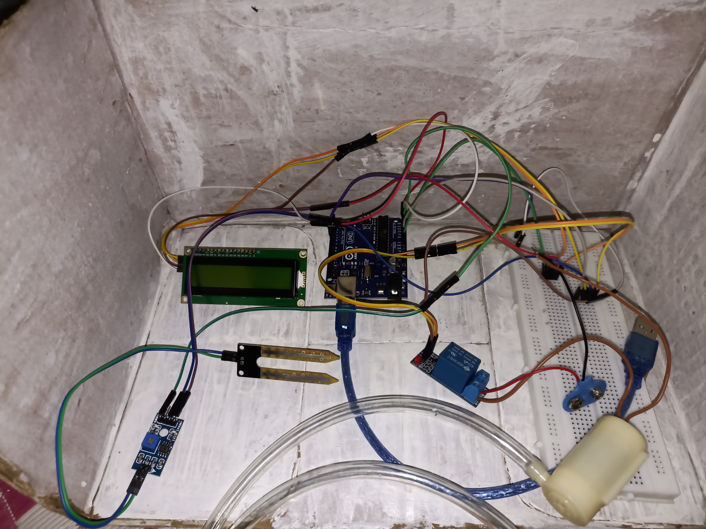

🌿 Smart Plant Irrigation System 

A group project that automates plant watering using Arduino UNO, soil moisture sensor, relay module, LCD, and water pump.

When the soil is dry, the system automatically turns on the pump and displays status on an I2C LCD. It's a low-cost, energy-efficient solution for small-scale irrigation.

## 🔧 Components Used
- Arduino UNO
- FC-28 Soil Moisture Sensor
- DHT11 Temperature & Humidity Sensor
- I2C LCD Display (16x2)
- Relay Module
- Submersible Mini Water Pump
- Breadboard, Jumper Wires, 9V Battery

## 🧠 How It Works
- Moisture sensor detects dryness in soil
- If dry, relay activates the water pump
- LCD shows current soil status and pump state
- Data is also logged in the Serial Monitor

## 📸 Hardware Setup

## 💻 Code
- Written in Arduino IDE using C++

## 🙌 Team Contribution
Built as a group project under the EEE domain to demonstrate real-world automation using embedded systems.

Feel free to reach out for collaboration!  
👤 TRISHA JANA | 📧 t50195317@gmail.com
